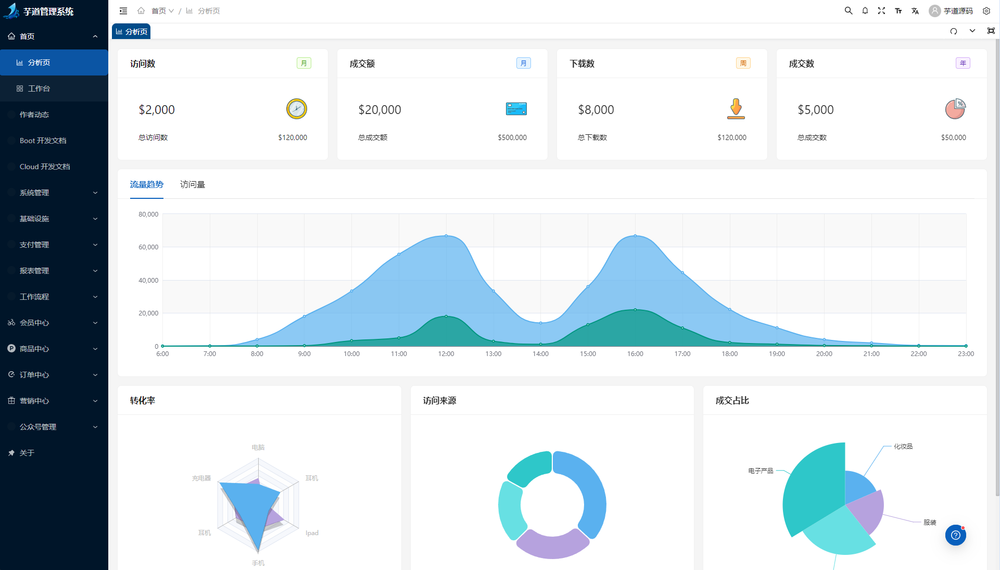

**严肃声明：现在、未来都不会有商业版本，所有代码全部开源!！**

**「我喜欢写代码，乐此不疲」**  
**「我喜欢做开源，以此为乐」**

如果这个项目让你有所收获，记得 Star 关注哦，这对我是非常不错的鼓励与支持。

## 预览地址

- 预览地址：<http://dashboard-vben.yudao.iocoder.cn/>
- 启动文档：<https://doc.iocoder.cn/quick-start/>
- 开发文档：<https://doc.vvbin.cn/>
- 视频教程：<https://doc.iocoder.cn/video/>
- 交流群：<https://doc.iocoder.cn/qun/>

## 外包项目请联系

微信号：xinyu370

## 框架

| 框架                                                                   | 说明               | 版本     |
|----------------------------------------------------------------------|------------------|--------|
| [Vue](https://staging-cn.vuejs.org/)                                 | Vue 框架           | 3.3.8  |
| [Vite](https://cn.vitejs.dev//)                                      | 开发与构建工具          | 4.5.0  |
| [ant-design-vue](https://antdv.com/)                                 | ant-design-vue   | 4.0.7  |
| [TypeScript](https://www.typescriptlang.org/docs/)                   | JavaScript 的超集   | 5.2.2  |
| [pinia](https://pinia.vuejs.org/)                                    | Vue 存储库 替代 vuex5 | 2.1.7  |
| [vueuse](https://vueuse.org/)                                        | 常用工具集            | 10.6.0 |
| [vue-i18n](https://kazupon.github.io/vue-i18n/zh/introduction.html/) | 国际化              | 9.6.5  |
| [vue-router](https://router.vuejs.org/)                              | Vue 路由           | 4.2.5  |
| [unocss](https://uno.antfu.me/)                                      | 原子 css           | 0.57.3 |
| [iconify](https://icon-sets.iconify.design/)                         | 在线图标库            | 3.1.1  |

## 浏览器支持

本地开发推荐使用 `Chrome 80+` 浏览器

支持现代浏览器, 不支持 IE

|  |  |  |  |  |
|:-----------------------------------------------------------------------------------------------:|:-------------------------------------------------------------------------------------------------:|:----------------------------------------------------------------------------------------------------------:|:-------------------------------------------------------------------------------------------------------:|:-------------------------------------------------------------------------------------------------------:|
|                     [IE](http://godban.github.io/browsers-support-badges/)                      |                     [Edge](http://godban.github.io/browsers-support-badgess/)                     |                        [Firefox](http://godban.github.io/browsers-support-badges/)                         |                       [Chrome](http://godban.github.io/browsers-support-badges/)                        |                       [Safari](http://godban.github.io/browsers-support-badges/)                        |
|                                           not support                                           |                                          last 2 versions                                          |                                              last 2 versions                                               |                                             last 2 versions                                             |                                             last 2 versions                                             |
