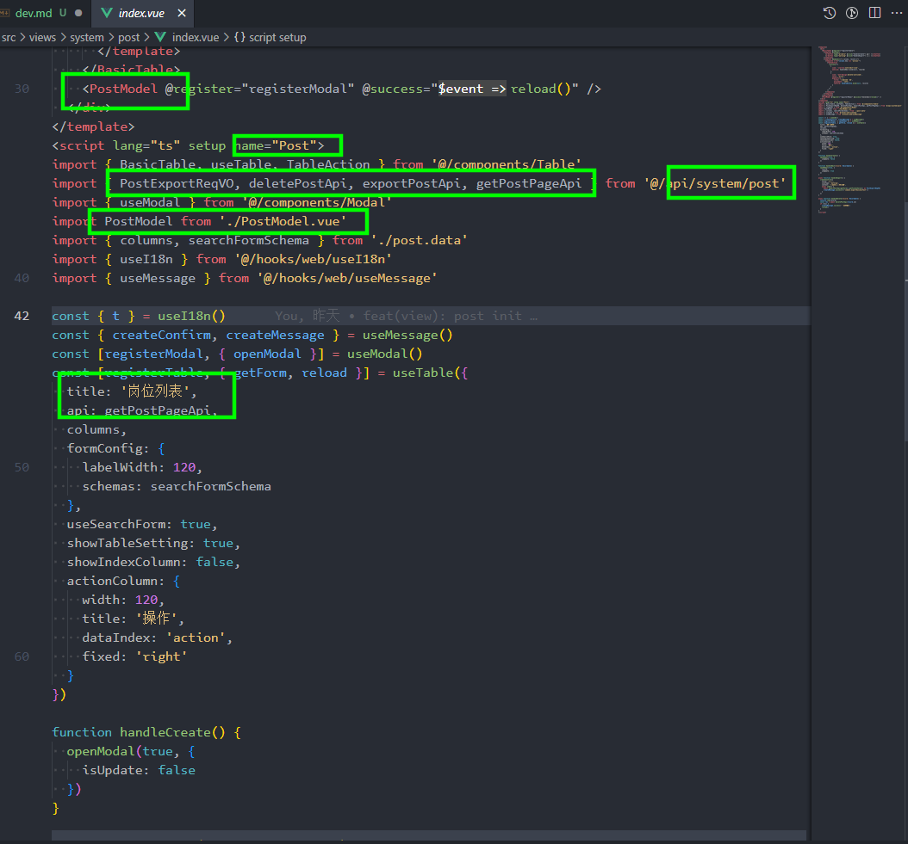

* [vue3 项目地址](https://gitee.com/xingyuv/yudao-ui-admin-vben)
* [vue2 项目地址](https://gitee.com/-/ide/project/zhijiantianya/ruoyi-vue-pro/edit/master/-/yudao-ui-admin/src/views/infra/config/index.vue)
* [vben 开发文档](https://doc.vvbin.cn/components/form.html)
* [vben 页面案例](https://gitee.com/xingyuv/vue-vben-admin)

* 为避免冲突，先fork vue3项目到自己仓库，然后clone下来，后续通过 pull request 方式提交代码
* vue3 需要node>16.18,最好使用pnpm进行包管理
* 安装pnpm
```base
npm add -g pnpm
```
* 启动项目
```base
pnpm i

pnpm dev
```  
* 目前大部分api接口已经迁移过来，view初始页面已经创建
* 基本上只需要在view里，将页面进行迁移即可
* 迁移方式
* 1. 在views下找到自己的开发模块
* 2. 复制system/post下三个文件到需要开发的路径下
* 3. 将post.data.ts 以及 PostModal.vue 更名为需要开发的名称（以下用role代替）
* 4. index.vue 中 修改script lang="ts" setup name="Post"中 name为Role PostModal 为RoleModal 详情看图
* 5. 修改post.data.ts  更名为role.data.ts 然后打开文档最上面的vue2代码，找到迁移的index.vue文件
* 6. 修改 columns 为 vue2 中 el-table-column 的参数 title 为 vue2中label ，dataIndex 为 prop
* 7. 修改 searchFormSchema 为 vue2 中 搜索工作栏 下 el-form-item 的参数，component 可参考其他已完成页面修改
* 8. 修改 formSchema 为 vue2 中 添加或修改参数配置对话框 的参数，component 可参考其他已完成页面修改
* 9. 修改 PostModal.vue ，更名为RoleModal.vue，如果所示的其他字段
* 10. 基本上70%以上的页面这样就可以完成了，修改完成后测试一下增删改查，如果没有问题就可以提交pr了

* 最后提交代码，本项目采用了cgz的形式，先git add 自己修改的文件，然后控制台pnpm commit,选择feat输入修改的页面，提交即可，他会自动检测代码是否有问题

